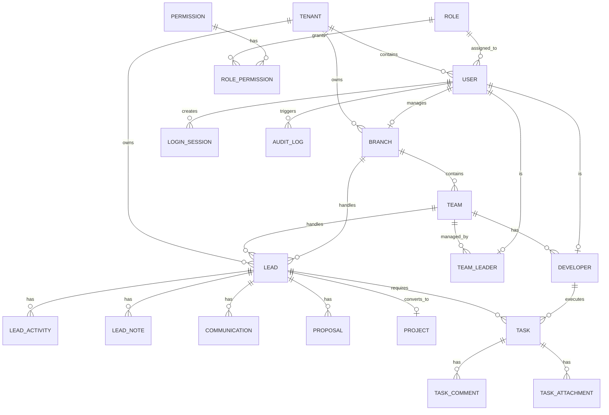
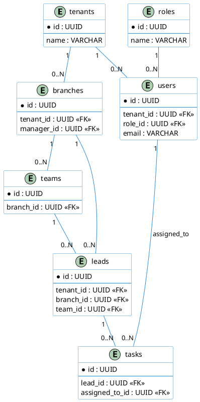

# Enterprise PostgreSQL Database Architecture

## 1. Complete Database Documentation
This document outlines the database schema for the CRM Lead Management SaaS application. Designed for PostgreSQL, it supports multi-tenancy, highly normalized data structures, role-based access control (RBAC), and robust audit logging.

### Multi-Tenant Architecture
The database isolates data primarily through a `tenant_id` column present in all transactional and operational tables. 
Global reference tables (like `roles` and `permissions`) do not have a `tenant_id` if they apply system-wide, but tenant-specific roles are supported.

## 2. Complete PostgreSQL Table List

| Table Name | Purpose | Soft Delete |
|------------|---------|-------------|
| `tenants` | Core isolation unit (Company/Workspace). | Yes (`deleted_at`) |
| `roles` | RBAC roles (Super Admin, Admin, Team Leader, Developer). | No |
| `permissions` | RBAC permissions for granular control. | No |
| `role_permissions` | Junction table for Roles and Permissions. | No |
| `users` | Base authentication table for all personnel. | Yes (`deleted_at`) |
| `login_sessions` | Tracks active JWT/Session tokens for security. | No |
| `branches` | Physical/logical locations assigned to a tenant. | Yes (`deleted_at`) |
| `teams` | Groups within a branch. | Yes (`deleted_at`) |
| `team_leaders` | Maps users as team managers. | No |
| `developers` | Maps users as developers under a team. | No |
| `leads` | Core prospect records. | Yes (`deleted_at`) |
| `lead_stages` | Lookup table for sales pipeline stages. | No |
| `lead_activities` | System-generated timeline for lead events. | No |
| `lead_notes` | Manual comments appended to a lead. | No |
| `communications` | Logs of calls, emails, and meetings. | No |
| `proposals` | Financial quotations for leads. | No |
| `projects` | Converted leads acting as delivery projects. | No |
| `tasks` | Actionable items assigned to developers. | Yes (`deleted_at`) |
| `task_comments` | Discussion threads on tasks. | No |
| `task_attachments` | File metadata linked to tasks. | No |
| `audit_logs` | Immutable ledger of system events. | No |
| `notifications` | System alerts for users. | No |

## 3. All Relationships & Cascade Rules

### System & Auth
- **Tenant -> Users**: One-to-Many. (ON DELETE CASCADE)
- **Role -> Users**: One-to-Many. (ON DELETE RESTRICT - cannot delete role if users have it)
- **Role -> Permissions**: Many-to-Many via `role_permissions`. (ON DELETE CASCADE)
- **User -> Login Sessions**: One-to-Many. (ON DELETE CASCADE)

### Organizational Hierarchy
- **Tenant -> Branches**: One-to-Many. (ON DELETE CASCADE)
- **Branch -> Teams**: One-to-Many. (ON DELETE CASCADE)
- **Branch -> Manager (User)**: One-to-One/Many. (ON DELETE SET NULL)
- **Team -> TeamLeader (User)**: One-to-One. (ON DELETE RESTRICT)
- **Team -> Developers (User)**: One-to-Many. (ON DELETE RESTRICT)

### CRM Workflow
- **Tenant -> Leads**: One-to-Many. (ON DELETE CASCADE)
- **Branch -> Leads**: One-to-Many. (ON DELETE RESTRICT)
- **Team -> Leads**: One-to-Many. (ON DELETE SET NULL)
- **Lead -> Lead Stages**: Many-to-One. (ON DELETE RESTRICT)
- **Lead -> Lead Activities / Notes / Communications**: One-to-Many. (ON DELETE CASCADE)
- **Lead -> Proposals**: One-to-Many. (ON DELETE CASCADE)
- **Lead -> Projects**: One-to-One. (ON DELETE RESTRICT)
- **Lead -> Tasks**: One-to-Many. (ON DELETE CASCADE)

### Task Management
- **Task -> Developer (Assignee)**: Many-to-One. (ON DELETE SET NULL)
- **Task -> Task Comments**: One-to-Many. (ON DELETE CASCADE)
- **Task -> Task Attachments**: One-to-Many. (ON DELETE CASCADE)

---

## 4. ER Diagram Description

### Mermaid ER Diagram

### PlantUML ER Diagram

---

## 5. Performance Review & Optimization Strategy

### Index Strategy
- **Primary Keys**: Automatically indexed by PostgreSQL (UUIDs).
- **Foreign Keys**: B-Tree indexes will be explicitly created on all foreign keys (e.g., `tenant_id`, `branch_id`, `lead_id`) to prevent full table scans during JOINs and CASCADE operations.
- **Tenant Isolation**: A composite index `(tenant_id, created_at)` is highly recommended on large tables (`leads`, `tasks`, `audit_logs`) to optimize multi-tenant paginated queries.
- **Search Optimization**: Generalized Inverted Index (GIN) or Trigram indexes (`pg_trgm`) should be applied to `leads.company_name`, `leads.contact_person`, and `tasks.title` for fast text searching.
- **Soft Delete Optimization**: Partial indexes `WHERE deleted_at IS NULL` will be applied to heavily queried tables so the optimizer can skip deleted rows entirely.

### Scalability Considerations
- **Connection Pooling**: Node.js `pg` Pool is required because opening connections in PostgreSQL is computationally expensive. The pool should be configured with `max: 20` (or appropriate depending on the VM size).
- **Partitioning**: As the SaaS grows, the `audit_logs` and `lead_activities` tables will grow exponentially. They should be partitioned by `range (created_at)` per month or year.
- **UUIDs**: UUIDv4 is used for security (preventing enumeration attacks across tenants) and allows for distributed ID generation if the database scales horizontally in the future.

### RBAC Implementation
Role hierarchy is managed via standard relational joins. When an Admin logs in, their JWT payload contains their `tenant_id` and `role_id`. Middleware will verify the JWT, extract permissions from Redis/Cache (or query `role_permissions`), and enforce the rules on the API endpoints.

---
*Generated for Phase 2 Architecture constraints.*
